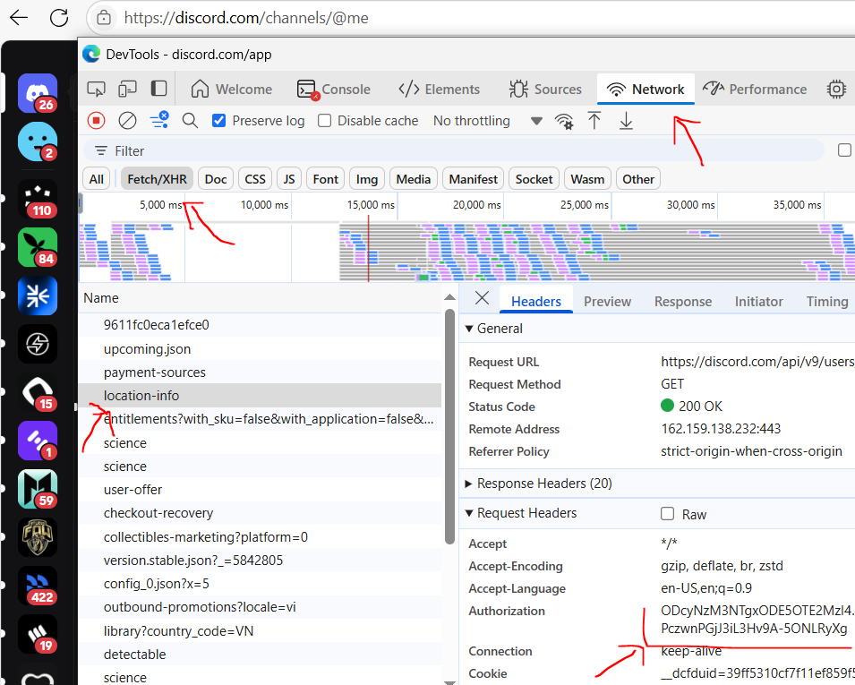

# ᝰ.ᐟ R2

Tool được phát triển bởi nhóm tele Airdrop Hunter Siêu Tốc (https://t.me/airdrophuntersieutoc)

Link: [https://r2.money](https://r2.money?code=Y2K4P)

Link tool: https://amautomarket.com/products/r2-final-testnet

## 🚨 Attention Before Running R2 Cli Version

I am not `responsible` for the possibility of an account being `banned`!

## 📎 R2 Node cli version Script features

- Auto faucet usdc discord
- Auto claim reward ss0
- Auto task transfers daily (swap/stake)
- Auto swap
- Auto stake
- Auto addliquidity
- Auto reff
- Support proxy or not
- Mutiple threads, multiple accounts

## ✎ᝰ. RUNNING

- Clone Repository

```bash
git clone https://github.com/Hunga9k50doker/r2.git
cd r2
```

- Install Dependency

```bash
npm install
```

- Setup config in .env

```bash
nano .env
```

- Setup input value

* discord token to faucet: open discord => F12 (right mouse + inspect) => tab network => like this image
  -per line per token => one wallet faucet

  

- proxy: http://user:pass@ip:port

```bash
nano proxies.txt
```

- privatekey: how to get => join my channel: https://t.me/airdrophuntersieutoc

```bash
nano privateKeys.txt
```

- Run the script

```bash
node main.js
```
